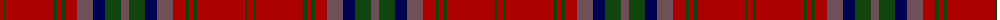

The parent of this is [MacDougall VS](/tartans/dr/6/dg2/dr48/dg4/dr4/dg4/dr12/n16/db12/dg16/n/8/)

This was sourced from weddslist.  It is a [11 stripes tartan](/stripes/stripes11/).

Original link http://www.weddslist.com/cgi-bin/tartans/pg.pl?source=x

## Thread count
DR/6 DG2 DR48 DG4 DR4 DG4 DR12 N16 DB12 DG16 N/8

## Palette
Each colour and its ΔE from the base-6 reference it is a variant of.

| Colour | Shade | Base | ΔE (OKLab) |
|---|---|---|---|
| DB |  `#000052` | B  | 0.20 |
| DG |  `#11450D` | G  | 0.10 |
| DR |  `#AA0000` | R  | 0.06 |
| N |  `#6E5058` | B  | 0.14 |

ID: /variants/dr/6/dg2/dr48/dg4/dr4/dg4/dr12/n16/db12/dg16/n/8-db000052-dg11450d-draa0000-n6e5058/
