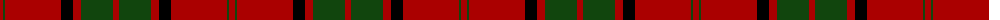
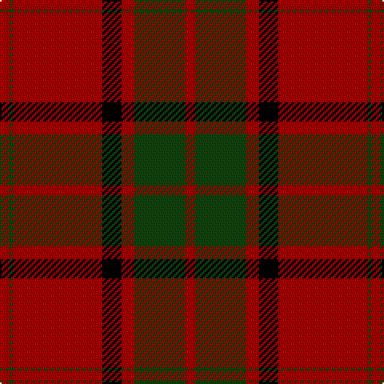

The parent of this is [Maxwell](/tartans/dr/6/dg2/dr56/k12/dr8/dg32/dr/6/)

This was sourced from weddslist.  It is a [7 stripes tartan](/stripes/stripes7/).

Original link http://www.weddslist.com/cgi-bin/tartans/pg.pl?source=x

## Thread count
DR/6 DG2 DR56 K12 DR8 DG32 DR/6

## Palette
Each colour and its ΔE from the base-6 reference it is a variant of.

| Colour | Shade | Base | ΔE (OKLab) |
|---|---|---|---|
| DG |  `#11450D` | G  | 0.10 |
| DR |  `#AA0000` | R  | 0.06 |
| K |  `#000000` | K  | 0.00 |

# Sample pattern

ID: /variants/dr/6/dg2/dr56/k12/dr8/dg32/dr/6-dg11450d-draa0000-k000000/
