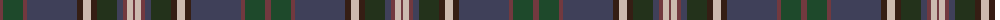

The parent of this is [Bowhunter](/tartans/dr/6/dg20/dr4/n50/ka6/na8/ka6/k20/n6/dr4/na6/dr/2/)

This was sourced from register-of-tartans.  It is a [12 stripes tartan](/stripes/stripes12/).

Original link https://www.tartanregister.gov.uk/tartanDetails.aspx?ref=10267

## Thread count
DR/6 DG20 DR4 N50 Ka6 Na8 Ka6 K20 N6 DR4 Na6 DR/2

## Palette
Each colour and its ΔE from the base-6 reference it is a variant of.

| Colour | Shade | Base | ΔE (OKLab) |
|---|---|---|---|
| DG |  `#1E492B` | G  | 0.11 |
| DR |  `#72393F` | B  | 0.16 |
| K |  `#23321B` | G  | 0.17 |
| Ka |  `#351E14` | B  | 0.20 |
| N |  `#3F4059` | B  | 0.08 |
| Na |  `#CCBAAF` | Y  | 0.15 |

ID: /variants/dr/6/dg20/dr4/n50/ka6/na8/ka6/k20/n6/dr4/na6/dr/2-dg1e492b-dr72393f-k23321b-ka351e14-n3f4059-naccbaaf/
