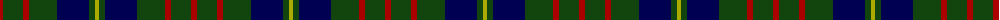
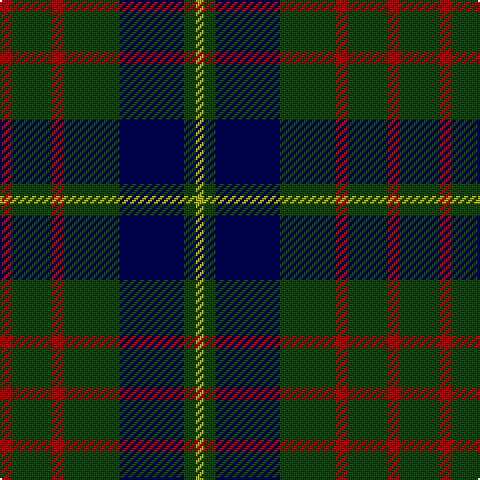

The parent of this is [Cameron Hunting](/tartans/dr/6/dg20/dr6/dg28/db32/dg6/lg/4/)

This was sourced from weddslist.  It is a [7 stripes tartan](/stripes/stripes7/).

Original link http://www.weddslist.com/cgi-bin/tartans/pg.pl?source=tinsel

## Thread count
DR/6 DG20 DR6 DG28 DB32 DG6 LG/4

## Palette
Each colour and its ΔE from the base-6 reference it is a variant of.

| Colour | Shade | Base | ΔE (OKLab) |
|---|---|---|---|
| DB |  `#000052` | B  | 0.20 |
| DG |  `#11450D` | G  | 0.10 |
| DR |  `#AA0000` | R  | 0.06 |
| LG |  `#AAAA00` | Y  | 0.11 |

# Sample pattern

ID: /variants/dr/6/dg20/dr6/dg28/db32/dg6/lg/4-db000052-dg11450d-draa0000-lgaaaa00/
