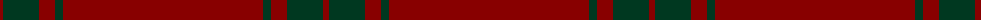

The parent of this is [KaDeWe (Corporate)](/tartans/dr/6/dg36/dr16/dg8/dr/200/)

This was sourced from tartans-authority.  It is a [5 stripes tartan](/stripes/stripes5/).

Original link http://www.tartansauthority.com/tartan-ferret/display/2696/

## Thread count
DR/6 DG36 DR16 DG8 DR/200

## Palette
Each colour and its ΔE from the base-6 reference it is a variant of.

| Colour | Shade | Base | ΔE (OKLab) |
|---|---|---|---|
| DG |  `#003820` | G  | 0.16 |
| DR |  `#880000` | R  | 0.14 |

# Sample pattern

ID: /variants/dr/6/dg36/dr16/dg8/dr/200-dg003820-dr880000/
