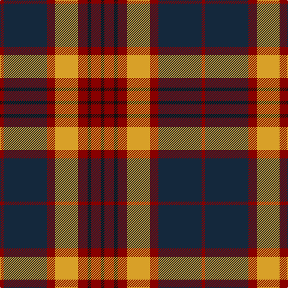

The parent of this is [Private SA Club (Corporate)](/tartans/dr/6/dn72/dr14/y38/dr16/k6/dr16/k/6/)

This was sourced from tartans-authority.  It is a [8 stripes tartan](/stripes/stripes8/).

Original link http://www.tartansauthority.com/tartan-ferret/display/6853/

## Thread count
DR/6 DN72 DR14 Y38 DR16 K6 DR16 K/6

## Palette
Each colour and its ΔE from the base-6 reference it is a variant of.

| Colour | Shade | Base | ΔE (OKLab) |
|---|---|---|---|
| DN |  `#14283C` | B  | 0.14 |
| DR |  `#880000` | R  | 0.14 |
| K |  `#101010` | K  | 0.17 |
| Y |  `#D8A028` | Y  | 0.09 |

# Sample pattern

ID: /variants/dr/6/dn72/dr14/y38/dr16/k6/dr16/k/6-dn14283c-dr880000-k101010-yd8a028/
