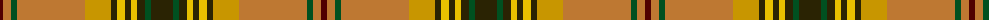

The parent of this is [Harmony 1](/tartans/dr/6/do8/g6/do68/dy26/k6/y8/k6/y6/k8/g6/k/22/)

This was sourced from register-of-tartans.  It is a [12 stripes tartan](/stripes/stripes12/).

Original link https://www.tartanregister.gov.uk/tartanDetails.aspx?ref=1602

## Thread count
DR/6 DO8 G6 DO68 DY26 K6 Y8 K6 Y6 K8 G6 K/22

## Palette
Each colour and its ΔE from the base-6 reference it is a variant of.

| Colour | Shade | Base | ΔE (OKLab) |
|---|---|---|---|
| DO |  `#BE7832` | R  | 0.17 |
| DR |  `#500000` | B  | 0.23 |
| DY |  `#C89600` | Y  | 0.12 |
| G |  `#005020` | G  | 0.08 |
| K |  `#2A2303` | B  | 0.21 |
| Y |  `#E8C000` | Y  | 0.00 |

ID: /variants/dr/6/do8/g6/do68/dy26/k6/y8/k6/y6/k8/g6/k/22-dobe7832-dr500000-dyc89600-g005020-k2a2303-ye8c000/
