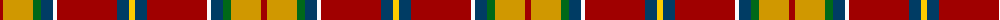

The parent of this is [Round Table Sweden](/tartans/dr/6/dy30/g8/db12/w4/dr60/db12/y/6/)

This was sourced from tartans-authority.  It is a [8 stripes tartan](/stripes/stripes8/).

Original link http://www.tartansauthority.com/tartan-ferret/display/10876/

## Thread count
DR/6 DY30 G8 DB12 W4 DR60 DB12 Y/6

## Palette
Each colour and its ΔE from the base-6 reference it is a variant of.

| Colour | Shade | Base | ΔE (OKLab) |
|---|---|---|---|
| DB |  `#003C64` | B  | 0.07 |
| DR |  `#A00000` | R  | 0.09 |
| DY |  `#D09800` | Y  | 0.11 |
| G |  `#006818` | G  | 0.02 |
| W |  `#FCFCFC` | W  | 0.03 |
| Y |  `#FCCC00` | Y  | 0.04 |

# Sample pattern

ID: /variants/dr/6/dy30/g8/db12/w4/dr60/db12/y/6-db003c64-dra00000-dyd09800-g006818-wfcfcfc-yfccc00/
