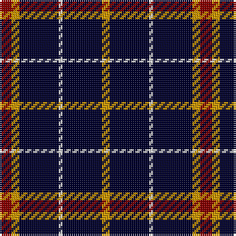

The parent of this is [St. Eloi](/tartans/dr/6/dy4/dba20/ln2/dba20/dy/4/)

This was sourced from register-of-tartans.  It is a [6 stripes tartan](/stripes/stripes6/).

Original link https://www.tartanregister.gov.uk/tartanDetails.aspx?ref=3889

## Thread count
DR/6 DY4 DBa20 LN2 DBa20 DY/4

## Palette
Each colour and its ΔE from the base-6 reference it is a variant of.

| Colour | Shade | Base | ΔE (OKLab) |
|---|---|---|---|
| DB |  `#1C0070` | B  | 0.14 |
| DBa |  `#00002C` | K  | 0.16 |
| DR |  `#880000` | R  | 0.14 |
| DY |  `#D09800` | Y  | 0.11 |
| LN |  `#E0E0E0` | W  | 0.06 |
| N |  `#C0C0C0` | W  | 0.16 |

# Sample pattern

ID: /variants/dr/6/dy4/dba20/ln2/dba20/dy/4-db1c0070-dba00002c-dr880000-dyd09800-lne0e0e0-nc0c0c0/
