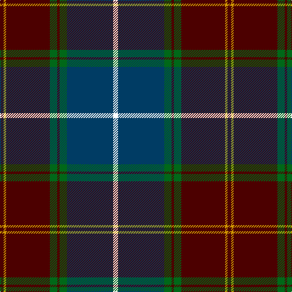

The parent of this is [Scotland 2000](/tartans/dr/6/dy4/dr72/g12/dr4/g12/db76/w/8/)

This was sourced from register-of-tartans.  It is a [8 stripes tartan](/stripes/stripes8/).

Original link https://www.tartanregister.gov.uk/tartanDetails.aspx?ref=3677

## Thread count
DR/6 DY4 DR72 G12 DR4 G12 DB76 W/8

## Palette
Each colour and its ΔE from the base-6 reference it is a variant of.

| Colour | Shade | Base | ΔE (OKLab) |
|---|---|---|---|
| DB |  `#003C64` | B  | 0.07 |
| DR |  `#4C0000` | B  | 0.24 |
| DY |  `#D09800` | Y  | 0.11 |
| G |  `#006818` | G  | 0.02 |
| W |  `#FFFFFF` | W  | 0.03 |

# Sample pattern

ID: /variants/dr/6/dy4/dr72/g12/dr4/g12/db76/w/8-db003c64-dr4c0000-dyd09800-g006818-wffffff/
