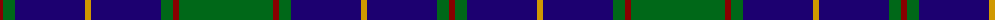

The parent of this is [Gracie](/tartans/dr/6/g12/db70/dy6/db70/g12/dr6/g/94/)

This was sourced from register-of-tartans.  It is a [8 stripes tartan](/stripes/stripes8/).

Original link https://www.tartanregister.gov.uk/tartanDetails.aspx?ref=1476

## Thread count
DR/6 G12 DB70 DY6 DB70 G12 DR6 G/94

## Palette
Each colour and its ΔE from the base-6 reference it is a variant of.

| Colour | Shade | Base | ΔE (OKLab) |
|---|---|---|---|
| DB |  `#1C0070` | B  | 0.14 |
| DR |  `#880000` | R  | 0.14 |
| DY |  `#D09800` | Y  | 0.11 |
| G |  `#006818` | G  | 0.02 |

# Sample pattern

ID: /variants/dr/6/g12/db70/dy6/db70/g12/dr6/g/94-db1c0070-dr880000-dyd09800-g006818/
