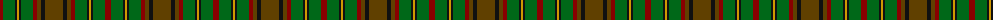

The parent of this is [MacAart (Personal)](/tartans/dr/6/g12/k2/dy2/k2/g12/dr4/t4/k4/t/18/)

This was sourced from register-of-tartans.  It is a [10 stripes tartan](/stripes/stripes10/).

Original link https://www.tartanregister.gov.uk/tartanDetails.aspx?ref=2262

## Thread count
DR/6 G12 K2 DY2 K2 G12 DR4 T4 K4 T/18

## Palette
Each colour and its ΔE from the base-6 reference it is a variant of.

| Colour | Shade | Base | ΔE (OKLab) |
|---|---|---|---|
| DR |  `#880000` | R  | 0.14 |
| DY |  `#D09800` | Y  | 0.11 |
| G |  `#006818` | G  | 0.02 |
| K |  `#101010` | K  | 0.17 |
| T |  `#604000` | G  | 0.14 |

ID: /variants/dr/6/g12/k2/dy2/k2/g12/dr4/t4/k4/t/18-dr880000-dyd09800-g006818-k101010-t604000/
