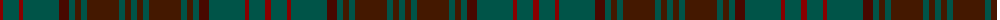

The parent of this is [Dublin, County (District)](/tartans/dr/6/g16/dr4/g36/drb10/g6/dra6/g6/dra32/g6/dra6/g/6/)

This was sourced from tartans-authority.  It is a [12 stripes tartan](/stripes/stripes12/).

Original link http://www.tartansauthority.com/tartan-ferret/display/2250/

## Thread count
DR/6 G16 DR4 G36 DRb10 G6 DRa6 G6 DRa32 G6 DRa6 G/6

## Palette
Each colour and its ΔE from the base-6 reference it is a variant of.

| Colour | Shade | Base | ΔE (OKLab) |
|---|---|---|---|
| DR |  `#880000` | R  | 0.14 |
| DRa |  `#441800` | B  | 0.22 |
| DRb |  `#480800` | B  | 0.23 |
| G |  `#005448` | G  | 0.11 |

ID: /variants/dr/6/g16/dr4/g36/drb10/g6/dra6/g6/dra32/g6/dra6/g/6-dr880000-dra441800-drb480800-g005448/
