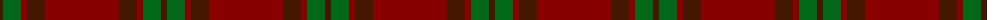

The parent of this is [Glen Shee #1 (Fashion)](/tartans/dr/6/g18/dra6/dr18/dra/74/)

This was sourced from tartans-authority.  It is a [5 stripes tartan](/stripes/stripes5/).

Original link http://www.tartansauthority.com/tartan-ferret/display/1662/

## Thread count
DR/6 G18 DRa6 DR18 DRa/74

## Palette
Each colour and its ΔE from the base-6 reference it is a variant of.

| Colour | Shade | Base | ΔE (OKLab) |
|---|---|---|---|
| DR |  `#441800` | B  | 0.22 |
| DRa |  `#880000` | R  | 0.14 |
| G |  `#006818` | G  | 0.02 |

# Sample pattern

ID: /variants/dr/6/g18/dra6/dr18/dra/74-dr441800-dra880000-g006818/
