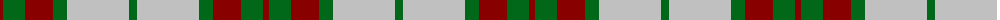
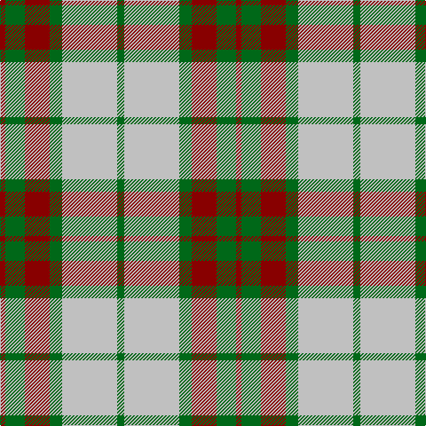

The parent of this is [Gleneagles USA (Corporate)](/tartans/dr/6/g22/dr28/g14/n62/g/8/)

This was sourced from tartans-authority.  It is a [6 stripes tartan](/stripes/stripes6/).

Original link http://www.tartansauthority.com/tartan-ferret/display/5032/

## Thread count
DR/6 G22 DR28 G14 N62 G/8

## Palette
Each colour and its ΔE from the base-6 reference it is a variant of.

| Colour | Shade | Base | ΔE (OKLab) |
|---|---|---|---|
| DR |  `#880000` | R  | 0.14 |
| G |  `#006818` | G  | 0.02 |
| N |  `#C0C0C0` | W  | 0.16 |

# Sample pattern

ID: /variants/dr/6/g22/dr28/g14/n62/g/8-dr880000-g006818-nc0c0c0/
