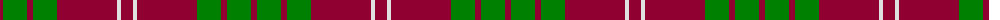

The parent of this is [Crawford](/tartans/dr/6/g24/dr6/g24/dr60/ln4/dr/12/)

This was sourced from weddslist.  It is a [7 stripes tartan](/stripes/stripes7/).

Original link http://www.weddslist.com/cgi-bin/tartans/pg.pl?source=sts

## Thread count
DR/6 G24 DR6 G24 DR60 LN4 DR/12

## Palette
Each colour and its ΔE from the base-6 reference it is a variant of.

| Colour | Shade | Base | ΔE (OKLab) |
|---|---|---|---|
| DR |  `#900030` | R  | 0.13 |
| G |  `#008000` | G  | 0.09 |
| LN |  `#E0E0E0` | W  | 0.06 |

# Sample pattern

ID: /variants/dr/6/g24/dr6/g24/dr60/ln4/dr/12-dr900030-g008000-lne0e0e0/
