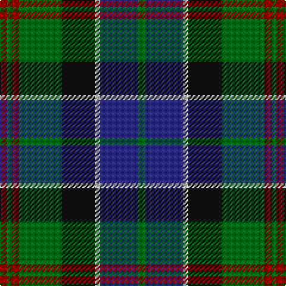

The parent of this is [Mantle (Personal)](/tartans/dr/6/g4/dr6/g36/k28/ln4/db32/g/6/)

This was sourced from tartans-authority.  It is a [8 stripes tartan](/stripes/stripes8/).

Original link http://www.tartansauthority.com/tartan-ferret/display/6945/

## Thread count
DR/6 G4 DR6 G36 K28 LN4 DB32 G/6

## Palette
Each colour and its ΔE from the base-6 reference it is a variant of.

| Colour | Shade | Base | ΔE (OKLab) |
|---|---|---|---|
| DB |  `#2C2C80` | B  | 0.05 |
| DR |  `#880000` | R  | 0.14 |
| G |  `#006818` | G  | 0.02 |
| K |  `#101010` | K  | 0.17 |
| LN |  `#E0E0E0` | W  | 0.06 |

# Sample pattern

ID: /variants/dr/6/g4/dr6/g36/k28/ln4/db32/g/6-db2c2c80-dr880000-g006818-k101010-lne0e0e0/
