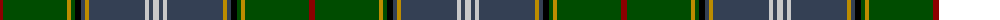

The parent of this is [Pringle (Personal)](/tartans/dr/6/g64/dy4/g4/k6/na4/dy4/na56/n4/na4/n/6/)

This was sourced from tartans-authority.  It is a [11 stripes tartan](/stripes/stripes11/).

Original link http://www.tartansauthority.com/tartan-ferret/display/5447/

## Thread count
DR/6 G64 DY4 G4 K6 Na4 DY4 Na56 N4 Na4 N/6

## Palette
Each colour and its ΔE from the base-6 reference it is a variant of.

| Colour | Shade | Base | ΔE (OKLab) |
|---|---|---|---|
| DR |  `#8C0000` | R  | 0.13 |
| DY |  `#BC8C00` | Y  | 0.16 |
| G |  `#004C00` | G  | 0.08 |
| K |  `#000000` | K  | 0.00 |
| N |  `#C8C8C8` | W  | 0.13 |
| Na |  `#344054` | B  | 0.08 |

ID: /variants/dr/6/g64/dy4/g4/k6/na4/dy4/na56/n4/na4/n/6-dr8c0000-dybc8c00-g004c00-k000000-nc8c8c8-na344054/
