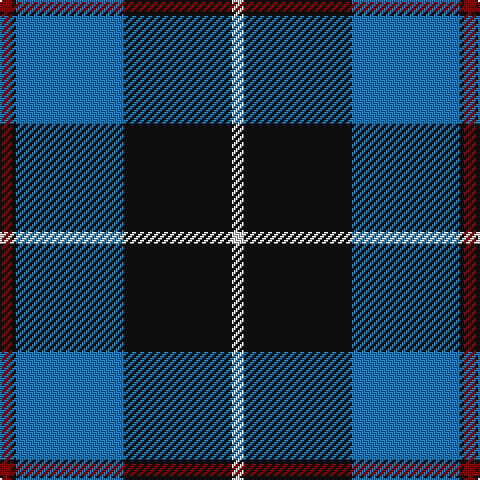

The parent of this is [Bro-Spirit of Northmen (Corporate)](/tartans/dr/6/k2/b54/k54/ln/6/)

This was sourced from tartans-authority.  It is a [5 stripes tartan](/stripes/stripes5/).

Original link http://www.tartansauthority.com/tartan-ferret/display/7906/

## Thread count
DR/6 K2 B54 K54 LN/6

## Palette
Each colour and its ΔE from the base-6 reference it is a variant of.

| Colour | Shade | Base | ΔE (OKLab) |
|---|---|---|---|
| B |  `#1474B4` | B  | 0.15 |
| DR |  `#880000` | R  | 0.14 |
| K |  `#101010` | K  | 0.17 |
| LN |  `#E0E0E0` | W  | 0.06 |

# Sample pattern

ID: /variants/dr/6/k2/b54/k54/ln/6-b1474b4-dr880000-k101010-lne0e0e0/
