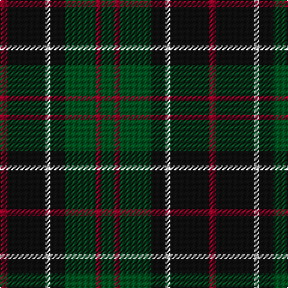

The parent of this is [Sinclair Hunting](/tartans/dr/6/k32/ln4/k12/g26/dr4/g/12/)

This was sourced from register-of-tartans.  It is a [7 stripes tartan](/stripes/stripes7/).

Original link https://www.tartanregister.gov.uk/tartanDetails.aspx?ref=3796

## Thread count
DR/6 K32 LN4 K12 G26 DR4 G/12

## Palette
Each colour and its ΔE from the base-6 reference it is a variant of.

| Colour | Shade | Base | ΔE (OKLab) |
|---|---|---|---|
| DR |  `#960028` | R  | 0.11 |
| G |  `#005020` | G  | 0.08 |
| K |  `#101010` | K  | 0.17 |
| LN |  `#E0E0E0` | W  | 0.06 |

# Sample pattern

ID: /variants/dr/6/k32/ln4/k12/g26/dr4/g/12-dr960028-g005020-k101010-lne0e0e0/
