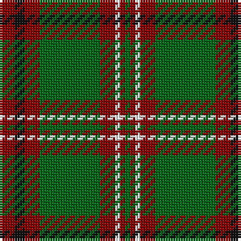

The parent of this is [MacCall/McCall](/tartans/dr/6/k4/dr6/g24/dr6/w2/dr2/g/2/)

This was sourced from register-of-tartans.  It is a [8 stripes tartan](/stripes/stripes8/).

Original link https://www.tartanregister.gov.uk/tartanDetails.aspx?ref=2305

## Thread count
DR/6 K4 DR6 G24 DR6 W2 DR2 G/2

## Palette
Each colour and its ΔE from the base-6 reference it is a variant of.

| Colour | Shade | Base | ΔE (OKLab) |
|---|---|---|---|
| DR |  `#880000` | R  | 0.14 |
| G |  `#006818` | G  | 0.02 |
| K |  `#101010` | K  | 0.17 |
| W |  `#FFFFFF` | W  | 0.03 |

# Sample pattern

ID: /variants/dr/6/k4/dr6/g24/dr6/w2/dr2/g/2-dr880000-g006818-k101010-wffffff/
