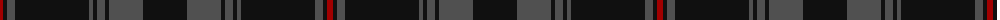

The parent of this is [Witches' Blood, The](/tartans/dr/6/k4/n8/k74/n4/k4/n8/k4/n34/k/44/)

This was sourced from register-of-tartans.  It is a [10 stripes tartan](/stripes/stripes10/).

Original link https://www.tartanregister.gov.uk/tartanDetails.aspx?ref=11495

## Thread count
DR/6 K4 N8 K74 N4 K4 N8 K4 N34 K/44

## Palette
Each colour and its ΔE from the base-6 reference it is a variant of.

| Colour | Shade | Base | ΔE (OKLab) |
|---|---|---|---|
| DR |  `#A00000` | R  | 0.09 |
| K |  `#101010` | K  | 0.17 |
| N |  `#505050` | B  | 0.12 |

ID: /variants/dr/6/k4/n8/k74/n4/k4/n8/k4/n34/k/44-dra00000-k101010-n505050/
