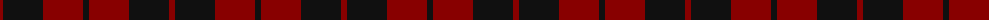

The parent of this is [Clan Anord (Corporate)](/tartans/dr/6/k40/dr40/k/6/)

This was sourced from tartans-authority.  It is a [4 stripes tartan](/stripes/stripes4/).

Original link http://www.tartansauthority.com/tartan-ferret/display/8245/

## Thread count
DR/6 K40 DR40 K/6

## Palette
Each colour and its ΔE from the base-6 reference it is a variant of.

| Colour | Shade | Base | ΔE (OKLab) |
|---|---|---|---|
| DR |  `#880000` | R  | 0.14 |
| K |  `#101010` | K  | 0.17 |

# Sample pattern

ID: /variants/dr/6/k40/dr40/k/6-dr880000-k101010/
