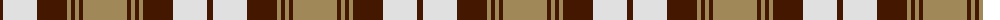

The parent of this is [Turnberry Manx Snaefell Family Tartan Tartan Number: 1749. Earliest known date: 1981 A coincidence. See products available Copyright © Blair Urquhart, Comrie, 2015](/tartans/dr/6/ln34/dr30/lt4/dr4/lt4/dr4/lt/44/)

This was sourced from house-of-tartan.  It is a [8 stripes tartan](/stripes/stripes8/).

Original link http://www.house-of-tartan.scotland.net/house/TartanViewjs.asp?colr=Def&tnam=1749

## Thread count
DR/6 LN34 DR30 LT4 DR4 LT4 DR4 LT/44

## Palette
Each colour and its ΔE from the base-6 reference it is a variant of.

| Colour | Shade | Base | ΔE (OKLab) |
|---|---|---|---|
| DR |  `#441800` | B  | 0.22 |
| LN |  `#E0E0E0` | W  | 0.06 |
| LT |  `#A08858` | Y  | 0.21 |

# Sample pattern

ID: /variants/dr/6/ln34/dr30/lt4/dr4/lt4/dr4/lt/44-dr441800-lne0e0e0-lta08858/
