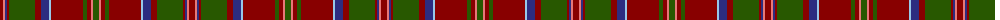

The parent of this is [MacDonald of Glencoe](/tartans/dr/6/lr2/db2/dr2/g26/dr6/db8/lb2/dr32/g4/dr4/lr2/g/6/)

This was sourced from register-of-tartans.  It is a [13 stripes tartan](/stripes/stripes13/).

Original link https://www.tartanregister.gov.uk/tartanDetails.aspx?ref=909

## Thread count
DR/6 LR2 DB2 DR2 G26 DR6 DB8 LB2 DR32 G4 DR4 LR2 G/6

## Palette
Each colour and its ΔE from the base-6 reference it is a variant of.

| Colour | Shade | Base | ΔE (OKLab) |
|---|---|---|---|
| DB |  `#2C2C80` | B  | 0.05 |
| DR |  `#880000` | R  | 0.14 |
| G |  `#285800` | G  | 0.04 |
| LB |  `#98C8E8` | W  | 0.17 |
| LR |  `#E87878` | R  | 0.19 |

ID: /variants/dr/6/lr2/db2/dr2/g26/dr6/db8/lb2/dr32/g4/dr4/lr2/g/6-db2c2c80-dr880000-g285800-lb98c8e8-lre87878/
