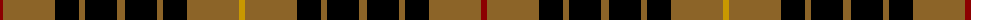

The parent of this is [Wcwm 1713](/tartans/dr/6/lt52/k24/lt6/k32/lt8/k32/lt6/k24/lt52/dy/6/)

This was sourced from register-of-tartans.  It is a [11 stripes tartan](/stripes/stripes11/).

Original link https://www.tartanregister.gov.uk/tartanDetails.aspx?ref=4542

## Thread count
DR/6 LT52 K24 LT6 K32 LT8 K32 LT6 K24 LT52 DY/6

## Palette
Each colour and its ΔE from the base-6 reference it is a variant of.

| Colour | Shade | Base | ΔE (OKLab) |
|---|---|---|---|
| DR |  `#8C0000` | R  | 0.13 |
| DY |  `#C89800` | Y  | 0.12 |
| K |  `#000000` | K  | 0.00 |
| LT |  `#8C6428` | R  | 0.16 |

ID: /variants/dr/6/lt52/k24/lt6/k32/lt8/k32/lt6/k24/lt52/dy/6-dr8c0000-dyc89800-k000000-lt8c6428/
