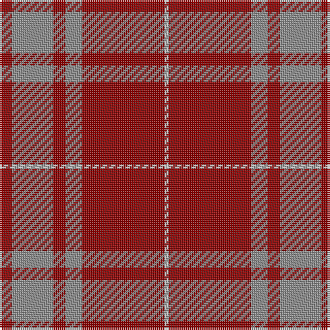

The parent of this is [Monica](/tartans/dr/6/n20/dr6/n8/dr40/na/2/)

This was sourced from register-of-tartans.  It is a [6 stripes tartan](/stripes/stripes6/).

Original link https://www.tartanregister.gov.uk/tartanDetails.aspx?ref=2984

## Thread count
DR/6 N20 DR6 N8 DR40 Na/2

## Palette
Each colour and its ΔE from the base-6 reference it is a variant of.

| Colour | Shade | Base | ΔE (OKLab) |
|---|---|---|---|
| DR |  `#8C0000` | R  | 0.13 |
| N |  `#8C8C8C` | R  | 0.24 |
| Na |  `#C8C8C8` | W  | 0.13 |

# Sample pattern

ID: /variants/dr/6/n20/dr6/n8/dr40/na/2-dr8c0000-n8c8c8c-nac8c8c8/
