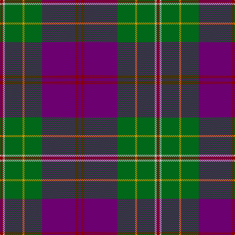

The parent of this is [Singh (Corporate)](/tartans/dr/6/n4/g36/dy4/g36/p68/dr6/p/6/)

This was sourced from tartans-authority.  It is a [8 stripes tartan](/stripes/stripes8/).

Original link http://www.tartansauthority.com/tartan-ferret/display/2600/

## Thread count
DR/6 N4 G36 DY4 G36 P68 DR6 P/6

## Palette
Each colour and its ΔE from the base-6 reference it is a variant of.

| Colour | Shade | Base | ΔE (OKLab) |
|---|---|---|---|
| DR |  `#880000` | R  | 0.14 |
| DY |  `#D09800` | Y  | 0.11 |
| G |  `#006818` | G  | 0.02 |
| N |  `#C0C0C0` | W  | 0.16 |
| P |  `#6C0070` | B  | 0.15 |

# Sample pattern

ID: /variants/dr/6/n4/g36/dy4/g36/p68/dr6/p/6-dr880000-dyd09800-g006818-nc0c0c0-p6c0070/
