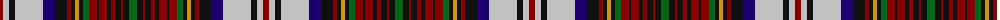

The parent of this is [Quadra](/tartans/dr/6/n6/k6/n28/db12/k12/dr4/k4/dy4/k4/g6/dr8/k2/dr8/k4/dr4/k6/dr2/k6/g/8/)

This was sourced from register-of-tartans.  It is a [20 stripes tartan](/stripes/stripes20/).

Original link https://www.tartanregister.gov.uk/tartanDetails.aspx?ref=3421

## Thread count
DR/6 N6 K6 N28 DB12 K12 DR4 K4 DY4 K4 G6 DR8 K2 DR8 K4 DR4 K6 DR2 K6 G/8

## Palette
Each colour and its ΔE from the base-6 reference it is a variant of.

| Colour | Shade | Base | ΔE (OKLab) |
|---|---|---|---|
| DB |  `#1C0070` | B  | 0.14 |
| DR |  `#880000` | R  | 0.14 |
| DY |  `#D09800` | Y  | 0.11 |
| G |  `#006818` | G  | 0.02 |
| K |  `#101010` | K  | 0.17 |
| N |  `#C0C0C0` | W  | 0.16 |

ID: /variants/dr/6/n6/k6/n28/db12/k12/dr4/k4/dy4/k4/g6/dr8/k2/dr8/k4/dr4/k6/dr2/k6/g/8-db1c0070-dr880000-dyd09800-g006818-k101010-nc0c0c0/
