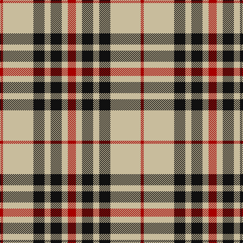

The parent of this is [Blackberry (Fashion)](/tartans/dr/6/n60/k22/n12/k22/n12/dr/16/)

This was sourced from tartans-authority.  It is a [7 stripes tartan](/stripes/stripes7/).

Original link http://www.tartansauthority.com/tartan-ferret/display/8083/

## Thread count
DR/6 N60 K22 N12 K22 N12 DR/16

## Palette
Each colour and its ΔE from the base-6 reference it is a variant of.

| Colour | Shade | Base | ΔE (OKLab) |
|---|---|---|---|
| DR |  `#A80000` | R  | 0.07 |
| K |  `#101010` | K  | 0.17 |
| N |  `#C8BC9C` | Y  | 0.12 |

# Sample pattern

ID: /variants/dr/6/n60/k22/n12/k22/n12/dr/16-dra80000-k101010-nc8bc9c/
