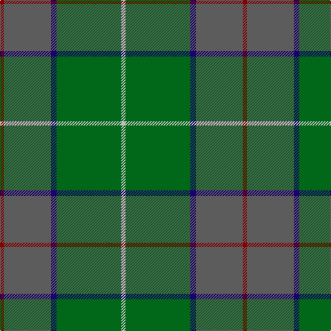

The parent of this is [Exabyte (Corporate)](/tartans/dr/6/n68/db8/g94/na/6/)

This was sourced from tartans-authority.  It is a [5 stripes tartan](/stripes/stripes5/).

Original link http://www.tartansauthority.com/tartan-ferret/display/2286/

## Thread count
DR/6 N68 DB8 G94 Na/6

## Palette
Each colour and its ΔE from the base-6 reference it is a variant of.

| Colour | Shade | Base | ΔE (OKLab) |
|---|---|---|---|
| DB |  `#1C0070` | B  | 0.14 |
| DR |  `#880000` | R  | 0.14 |
| G |  `#006818` | G  | 0.02 |
| N |  `#5C5C5C` | B  | 0.14 |
| Na |  `#C0C0C0` | W  | 0.16 |

# Sample pattern

ID: /variants/dr/6/n68/db8/g94/na/6-db1c0070-dr880000-g006818-n5c5c5c-nac0c0c0/
