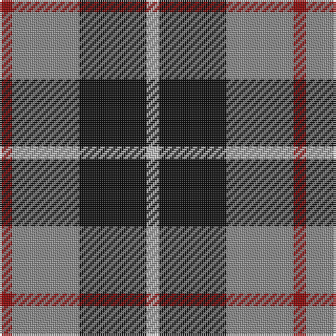

The parent of this is [Thompson, Dress (Clan)](/tartans/dr/6/na32/k32/n/6/)

This was sourced from tartans-authority.  It is a [4 stripes tartan](/stripes/stripes4/).

Original link http://www.tartansauthority.com/tartan-ferret/display/3597/

## Thread count
DR/6 Na32 K32 N/6

## Palette
Each colour and its ΔE from the base-6 reference it is a variant of.

| Colour | Shade | Base | ΔE (OKLab) |
|---|---|---|---|
| DR |  `#880000` | R  | 0.14 |
| K |  `#101010` | K  | 0.17 |
| N |  `#C0C0C0` | W  | 0.16 |
| Na |  `#888888` | R  | 0.24 |

# Sample pattern

ID: /variants/dr/6/na32/k32/n/6-dr880000-k101010-nc0c0c0-na888888/
