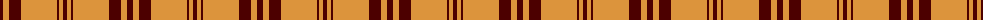
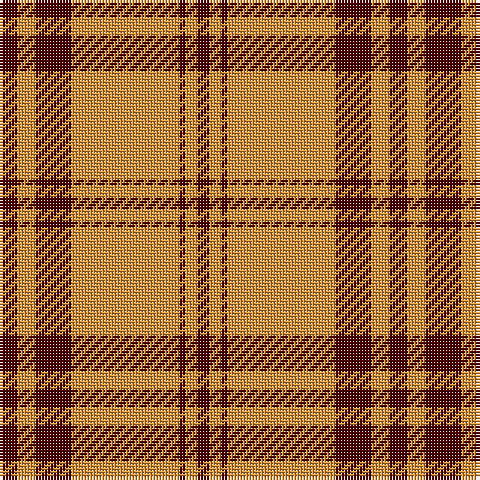

The parent of this is [Loughheed (Personal)](/tartans/dr/6/o6/dr8/dr4/o36/dr2/o4/dr/4/)

This was sourced from tartans-authority.  It is a [8 stripes tartan](/stripes/stripes8/).

Original link http://www.tartansauthority.com/tartan-ferret/display/4112/

## Thread count
DR/6 O6 DR8 DR4 O36 DR2 O4 DR/4

## Palette
Each colour and its ΔE from the base-6 reference it is a variant of.

| Colour | Shade | Base | ΔE (OKLab) |
|---|---|---|---|
| DR |  `#4C0000` | B  | 0.24 |
| O |  `#DC943C` | Y  | 0.12 |

# Sample pattern

ID: /variants/dr/6/o6/dr8/dr4/o36/dr2/o4/dr/4-dr4c0000-odc943c/
