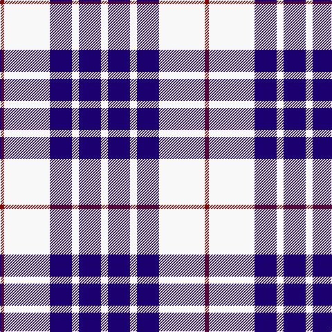

The parent of this is [Buchanan Dress, Blue (Dance)](/tartans/dr/6/w66/db32/w10/db32/w/10/)

This was sourced from tartans-authority.  It is a [6 stripes tartan](/stripes/stripes6/).

Original link http://www.tartansauthority.com/tartan-ferret/display/1672/

## Thread count
DR/6 W66 DB32 W10 DB32 W/10

## Palette
Each colour and its ΔE from the base-6 reference it is a variant of.

| Colour | Shade | Base | ΔE (OKLab) |
|---|---|---|---|
| DB |  `#1C0070` | B  | 0.14 |
| DR |  `#880000` | R  | 0.14 |
| W |  `#F8F8F8` | W  | 0.01 |

# Sample pattern

ID: /variants/dr/6/w66/db32/w10/db32/w/10-db1c0070-dr880000-wf8f8f8/
