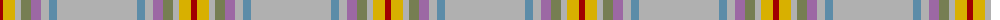

The parent of this is [Miller Hargreaves (Personal)](/tartans/dr/6/y12/n6/g10/lp10/n8/b8/n/80/)

This was sourced from register-of-tartans.  It is a [8 stripes tartan](/stripes/stripes8/).

Original link https://www.tartanregister.gov.uk/tartanDetails.aspx?ref=11252

## Thread count
DR/6 Y12 N6 G10 LP10 N8 B8 N/80

## Palette
Each colour and its ΔE from the base-6 reference it is a variant of.

| Colour | Shade | Base | ΔE (OKLab) |
|---|---|---|---|
| B |  `#5C8CA8` | B  | 0.23 |
| DR |  `#A00000` | R  | 0.09 |
| G |  `#767E52` | G  | 0.17 |
| LP |  `#9C68A4` | R  | 0.21 |
| N |  `#B0B0B0` | Y  | 0.18 |
| Y |  `#D8B000` | Y  | 0.05 |

# Sample pattern

ID: /variants/dr/6/y12/n6/g10/lp10/n8/b8/n/80-b5c8ca8-dra00000-g767e52-lp9c68a4-nb0b0b0-yd8b000/
