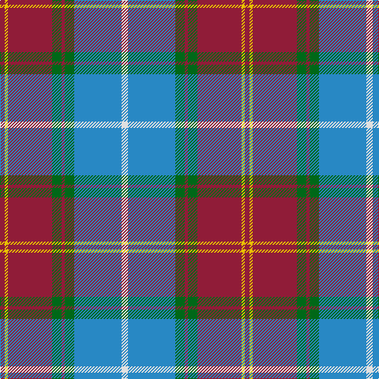

The parent of this is [Scotland 2000 Commemorative Tartan Tartan Number: 2514. Earliest known date: 1999 Strathmore Woollen Mills Millenium tartan designed by Arthur Mackie of Strathmore Woollen Co., Forfar See products available Copyright © Blair Urquhart, Comrie, 2015](/tartans/dr/6/y4/dr56/g12/dr4/g12/b60/ln/8/)

This was sourced from house-of-tartan.  It is a [8 stripes tartan](/stripes/stripes8/).

Original link http://www.house-of-tartan.scotland.net/house/TartanViewjs.asp?colr=Def&tnam=2514

## Thread count
DR/6 Y4 DR56 G12 DR4 G12 B60 LN/8

## Palette
Each colour and its ΔE from the base-6 reference it is a variant of.

| Colour | Shade | Base | ΔE (OKLab) |
|---|---|---|---|
| B |  `#2888C4` | B  | 0.21 |
| DR |  `#901C38` | R  | 0.12 |
| G |  `#006818` | G  | 0.02 |
| LN |  `#E0E0E0` | W  | 0.06 |
| Y |  `#E8C000` | Y  | 0.00 |

# Sample pattern

ID: /variants/dr/6/y4/dr56/g12/dr4/g12/b60/ln/8-b2888c4-dr901c38-g006818-lne0e0e0-ye8c000/
