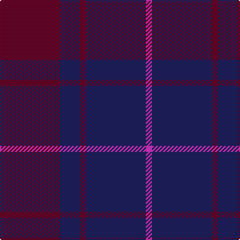

The parent of this is [Feniston (Personal)](/tartans/dr/60/db20/dr6/db60/lr/6/)

This was sourced from tartans-authority.  It is a [5 stripes tartan](/stripes/stripes5/).

Original link http://www.tartansauthority.com/tartan-ferret/display/3996/

## Thread count
DR/60 DB20 DR6 DB60 LR/6

## Palette
Each colour and its ΔE from the base-6 reference it is a variant of.

| Colour | Shade | Base | ΔE (OKLab) |
|---|---|---|---|
| DB |  `#202060` | B  | 0.11 |
| DR |  `#680028` | B  | 0.20 |
| LR |  `#EC34C4` | R  | 0.24 |

# Sample pattern

ID: /variants/dr/60/db20/dr6/db60/lr/6-db202060-dr680028-lrec34c4/
