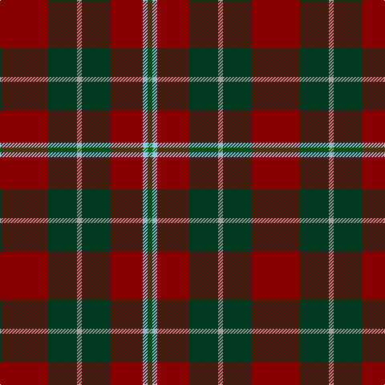

The parent of this is [Tartan for London, A (Fashion)](/tartans/dr/60/dg36/n6/dg36/dr40/lb6/g/6/)

This was sourced from tartans-authority.  It is a [7 stripes tartan](/stripes/stripes7/).

Original link http://www.tartansauthority.com/tartan-ferret/display/8128/

## Thread count
DR/60 DG36 N6 DG36 DR40 LB6 G/6

## Palette
Each colour and its ΔE from the base-6 reference it is a variant of.

| Colour | Shade | Base | ΔE (OKLab) |
|---|---|---|---|
| DG |  `#003820` | G  | 0.16 |
| DR |  `#880000` | R  | 0.14 |
| G |  `#006818` | G  | 0.02 |
| LB |  `#98C8E8` | W  | 0.17 |
| N |  `#A0A0A0` | Y  | 0.20 |

# Sample pattern

ID: /variants/dr/60/dg36/n6/dg36/dr40/lb6/g/6-dg003820-dr880000-g006818-lb98c8e8-na0a0a0/
