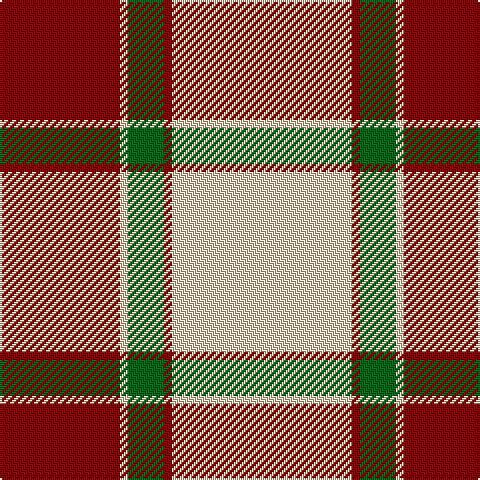

The parent of this is [Malaysian Unknown (Artefact)](/tartans/dr/60/lr4/g18/dr4/lr/90/)

This was sourced from tartans-authority.  It is a [5 stripes tartan](/stripes/stripes5/).

Original link http://www.tartansauthority.com/tartan-ferret/display/8667/

## Thread count
DR/60 LR4 G18 DR4 LR/90

## Palette
Each colour and its ΔE from the base-6 reference it is a variant of.

| Colour | Shade | Base | ΔE (OKLab) |
|---|---|---|---|
| DR |  `#880000` | R  | 0.14 |
| G |  `#006818` | G  | 0.02 |
| LR |  `#E8CCB8` | W  | 0.11 |

# Sample pattern

ID: /variants/dr/60/lr4/g18/dr4/lr/90-dr880000-g006818-lre8ccb8/
