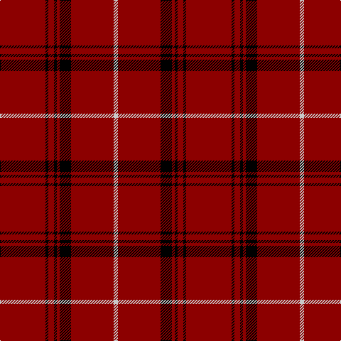

The parent of this is [University of Chicago (Corporate)](/tartans/dr/64/k4/dr8/k4/dr4/k16/dr60/n/6/)

This was sourced from tartans-authority.  It is a [8 stripes tartan](/stripes/stripes8/).

Original link http://www.tartansauthority.com/tartan-ferret/display/2073/

## Thread count
DR/64 K4 DR8 K4 DR4 K16 DR60 N/6

## Palette
Each colour and its ΔE from the base-6 reference it is a variant of.

| Colour | Shade | Base | ΔE (OKLab) |
|---|---|---|---|
| DR |  `#8C0000` | R  | 0.13 |
| K |  `#000000` | K  | 0.00 |
| N |  `#C8C8C8` | W  | 0.13 |

# Sample pattern

ID: /variants/dr/64/k4/dr8/k4/dr4/k16/dr60/n/6-dr8c0000-k000000-nc8c8c8/
