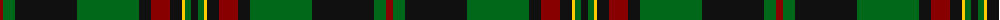

The parent of this is [Danareth (Corporate)](/tartans/dr/7/g12/k62/g62/k12/dr19/k12/y3/g6/k/7/)

This was sourced from tartans-authority.  It is a [10 stripes tartan](/stripes/stripes10/).

Original link http://www.tartansauthority.com/tartan-ferret/display/10555/

## Thread count
DR/7 G12 K62 G62 K12 DR19 K12 Y3 G6 K/7

## Palette
Each colour and its ΔE from the base-6 reference it is a variant of.

| Colour | Shade | Base | ΔE (OKLab) |
|---|---|---|---|
| DR |  `#880000` | R  | 0.14 |
| G |  `#006818` | G  | 0.02 |
| K |  `#101010` | K  | 0.17 |
| Y |  `#FCCC00` | Y  | 0.04 |

ID: /variants/dr/7/g12/k62/g62/k12/dr19/k12/y3/g6/k/7-dr880000-g006818-k101010-yfccc00/
