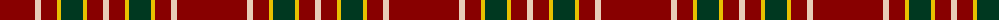
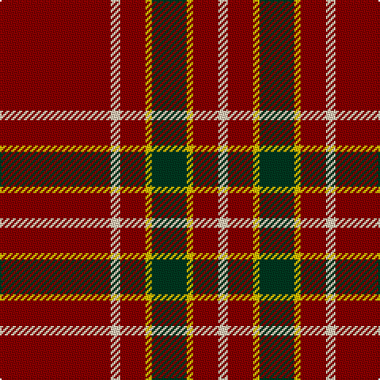

The parent of this is [Highlands of Wyomissing (Corporate)](/tartans/dr/70/lr6/dr16/y4/dg22/y4/dr16/lr/6/)

This was sourced from tartans-authority.  It is a [8 stripes tartan](/stripes/stripes8/).

Original link http://www.tartansauthority.com/tartan-ferret/display/10958/

## Thread count
DR/70 LR6 DR16 Y4 DG22 Y4 DR16 LR/6

## Palette
Each colour and its ΔE from the base-6 reference it is a variant of.

| Colour | Shade | Base | ΔE (OKLab) |
|---|---|---|---|
| DG |  `#003820` | G  | 0.16 |
| DR |  `#880000` | R  | 0.14 |
| LR |  `#E8CCB8` | W  | 0.11 |
| Y |  `#E8C000` | Y  | 0.00 |

# Sample pattern

ID: /variants/dr/70/lr6/dr16/y4/dg22/y4/dr16/lr/6-dg003820-dr880000-lre8ccb8-ye8c000/
