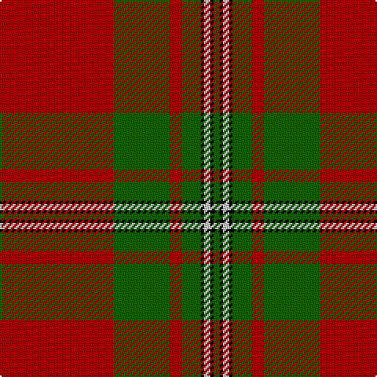

The parent of this is [Strang (Personal)](/tartans/dr/72/g36/dr8/g12/k2/n4/k2/g/4/)

This was sourced from tartans-authority.  It is a [8 stripes tartan](/stripes/stripes8/).

Original link http://www.tartansauthority.com/tartan-ferret/display/4168/

## Thread count
DR/72 G36 DR8 G12 K2 N4 K2 G/4

## Palette
Each colour and its ΔE from the base-6 reference it is a variant of.

| Colour | Shade | Base | ΔE (OKLab) |
|---|---|---|---|
| DR |  `#B00000` | R  | 0.05 |
| G |  `#146400` | G  | 0.01 |
| K |  `#000000` | K  | 0.00 |
| N |  `#C8C8C8` | W  | 0.13 |

# Sample pattern

ID: /variants/dr/72/g36/dr8/g12/k2/n4/k2/g/4-drb00000-g146400-k000000-nc8c8c8/
