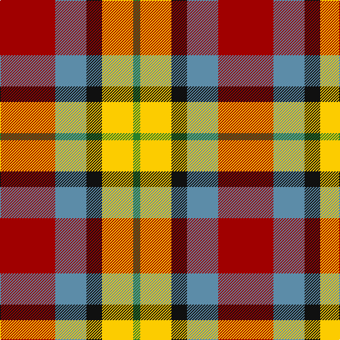

The parent of this is [Abbink, Ingmar (Personal)](/tartans/dr/78/b44/k22/y44/g/10/)

This was sourced from tartans-authority.  It is a [5 stripes tartan](/stripes/stripes5/).

Original link http://www.tartansauthority.com/tartan-ferret/display/11071/

## Thread count
DR/78 B44 K22 Y44 G/10

## Palette
Each colour and its ΔE from the base-6 reference it is a variant of.

| Colour | Shade | Base | ΔE (OKLab) |
|---|---|---|---|
| B |  `#5C8CA8` | B  | 0.23 |
| DR |  `#A00000` | R  | 0.09 |
| G |  `#288028` | G  | 0.09 |
| K |  `#101010` | K  | 0.17 |
| Y |  `#FCCC00` | Y  | 0.04 |

# Sample pattern

ID: /variants/dr/78/b44/k22/y44/g/10-b5c8ca8-dra00000-g288028-k101010-yfccc00/
