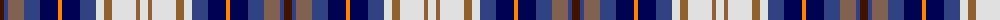

The parent of this is [Unidentified, Gordon variant](/tartans/dr/8/b4/lta16/b16/db18/o4/db18/b16/ln8/lt8/ln24/lt4/ln/8/)

This was sourced from weddslist.  It is a [13 stripes tartan](/stripes/stripes13/).

Original link http://www.weddslist.com/cgi-bin/tartans/pg.pl?source=sts

## Thread count
DR/8 B4 LTa16 B16 DB18 O4 DB18 B16 LN8 LT8 LN24 LT4 LN/8

## Palette
Each colour and its ΔE from the base-6 reference it is a variant of.

| Colour | Shade | Base | ΔE (OKLab) |
|---|---|---|---|
| B |  `#304080` | B  | 0.01 |
| DB |  `#000050` | B  | 0.20 |
| DR |  `#401000` | B  | 0.23 |
| LN |  `#E0E0E0` | W  | 0.06 |
| LT |  `#906030` | R  | 0.15 |
| LTa |  `#806050` | R  | 0.17 |
| O |  `#FF8500` | Y  | 0.14 |

ID: /variants/dr/8/b4/lta16/b16/db18/o4/db18/b16/ln8/lt8/ln24/lt4/ln/8-b304080-db000050-dr401000-lne0e0e0-lt906030-lta806050-off8500/
