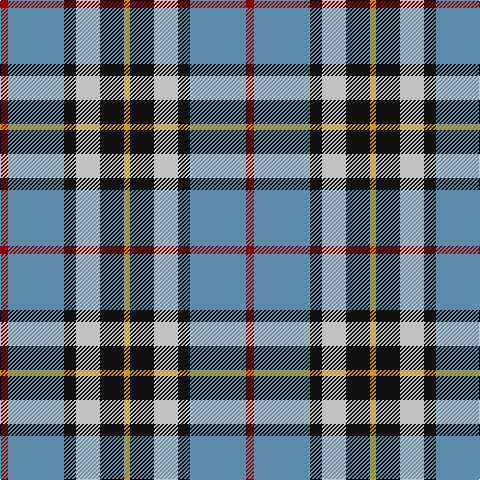

The parent of this is [MacTavish Dress](/tartans/dr/8/b56/k12/n24/k24/dy/6/)

This was sourced from tartans-authority.  It is a [6 stripes tartan](/stripes/stripes6/).

Original link http://www.tartansauthority.com/tartan-ferret/display/1383/

## Thread count
DR/8 B56 K12 N24 K24 DY/6

## Palette
Each colour and its ΔE from the base-6 reference it is a variant of.

| Colour | Shade | Base | ΔE (OKLab) |
|---|---|---|---|
| B |  `#5C8CA8` | B  | 0.23 |
| DR |  `#880000` | R  | 0.14 |
| DY |  `#D09800` | Y  | 0.11 |
| K |  `#101010` | K  | 0.17 |
| N |  `#C0C0C0` | W  | 0.16 |

# Sample pattern

ID: /variants/dr/8/b56/k12/n24/k24/dy/6-b5c8ca8-dr880000-dyd09800-k101010-nc0c0c0/
