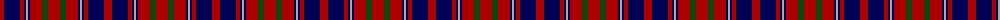

The parent of this is [Cameron of Locheil](/tartans/dr/8/db16/dr4/db2/n2/db2/dr12/dg6/dr/12/)

This was sourced from weddslist.  It is a [9 stripes tartan](/stripes/stripes9/).

Original link http://www.weddslist.com/cgi-bin/tartans/pg.pl?source=x

## Thread count
DR/8 DB16 DR4 DB2 N2 DB2 DR12 DG6 DR/12

## Palette
Each colour and its ΔE from the base-6 reference it is a variant of.

| Colour | Shade | Base | ΔE (OKLab) |
|---|---|---|---|
| DB |  `#000052` | B  | 0.20 |
| DG |  `#11450D` | G  | 0.10 |
| DR |  `#AA0000` | R  | 0.06 |
| N |  `#AAAAAA` | Y  | 0.19 |

ID: /variants/dr/8/db16/dr4/db2/n2/db2/dr12/dg6/dr/12-db000052-dg11450d-draa0000-naaaaaa/
