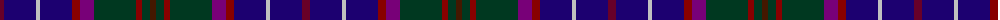

The parent of this is [Scottish Lion (Corporate)](/tartans/dr/8/db32/n4/db32/drb8/p14/dg42/drb6/dg8/dra/6/)

This was sourced from tartans-authority.  It is a [10 stripes tartan](/stripes/stripes10/).

Original link http://www.tartansauthority.com/tartan-ferret/display/3184/

## Thread count
DR/8 DB32 N4 DB32 DRb8 P14 DG42 DRb6 DG8 DRa/6

## Palette
Each colour and its ΔE from the base-6 reference it is a variant of.

| Colour | Shade | Base | ΔE (OKLab) |
|---|---|---|---|
| DB |  `#1C0070` | B  | 0.14 |
| DG |  `#003820` | G  | 0.16 |
| DR |  `#680028` | B  | 0.20 |
| DRa |  `#441800` | B  | 0.22 |
| DRb |  `#880000` | R  | 0.14 |
| N |  `#C0C0C0` | W  | 0.16 |
| P |  `#780078` | B  | 0.16 |

ID: /variants/dr/8/db32/n4/db32/drb8/p14/dg42/drb6/dg8/dra/6-db1c0070-dg003820-dr680028-dra441800-drb880000-nc0c0c0-p780078/
