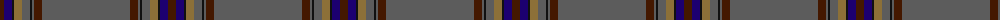

The parent of this is [Fermanagh (1990)](/tartans/dr/8/db8/k2/lt8/n8/k2/n2/dr8/n/88/)

This was sourced from register-of-tartans.  It is a [9 stripes tartan](/stripes/stripes9/).

Original link https://www.tartanregister.gov.uk/tartanDetails.aspx?ref=5225

## Thread count
DR/8 DB8 K2 LT8 N8 K2 N2 DR8 N/88

## Palette
Each colour and its ΔE from the base-6 reference it is a variant of.

| Colour | Shade | Base | ΔE (OKLab) |
|---|---|---|---|
| DB |  `#1C0070` | B  | 0.14 |
| DR |  `#441800` | B  | 0.22 |
| K |  `#101010` | K  | 0.17 |
| LT |  `#8C7038` | G  | 0.18 |
| N |  `#5C5C5C` | B  | 0.14 |

ID: /variants/dr/8/db8/k2/lt8/n8/k2/n2/dr8/n/88-db1c0070-dr441800-k101010-lt8c7038-n5c5c5c/
