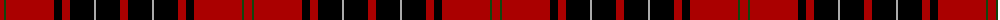

The parent of this is [Wemyss](/tartans/dr/8/dg2/dr48/k8/dr8/k24/n2/k24/dr/8/)

This was sourced from weddslist.  It is a [9 stripes tartan](/stripes/stripes9/).

Original link http://www.weddslist.com/cgi-bin/tartans/pg.pl?source=x

## Thread count
DR/8 DG2 DR48 K8 DR8 K24 N2 K24 DR/8

## Palette
Each colour and its ΔE from the base-6 reference it is a variant of.

| Colour | Shade | Base | ΔE (OKLab) |
|---|---|---|---|
| DG |  `#11450D` | G  | 0.10 |
| DR |  `#AA0000` | R  | 0.06 |
| K |  `#000000` | K  | 0.00 |
| N |  `#AAAAAA` | Y  | 0.19 |

ID: /variants/dr/8/dg2/dr48/k8/dr8/k24/n2/k24/dr/8-dg11450d-draa0000-k000000-naaaaaa/
